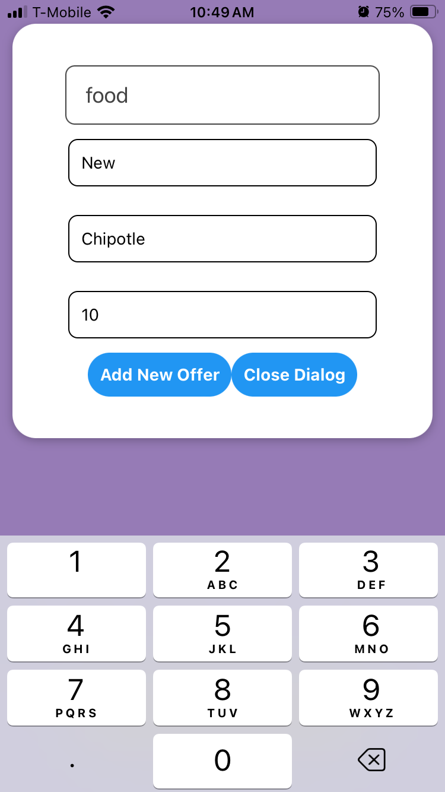
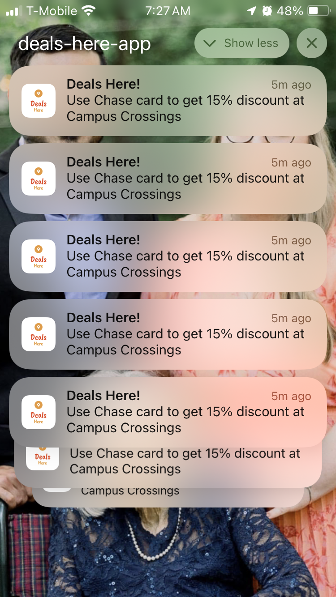

# Deals here!
A proximity-based deal finder application leveraging your credit card deal subscriptions, emphasizing low-latency, data privacy, and local push notifications. We utilize open-source APIs to eliminate costs associated with finding great deals for you.

## Features
- API driven dropdown for Banks & Type of deals - *Done*
- MapView for all deals in list displayed/pinned on map - *In Progress*
- Iron out decision generator - *Done*
- Navigation system - *Done*
- Add Settings Page - *In Progress*
- Add persistent storage - *Done*
- Fix Bug for non stop notifications when deal found - *Done*
- Maintain history of deals achieved - *In Progress*
- Stretch goal - Use Generative AI to get insights from deals achieved

You can find the app on Apple store. Some of the App screenshots are available here. Thanks for your support.

    
    
    

